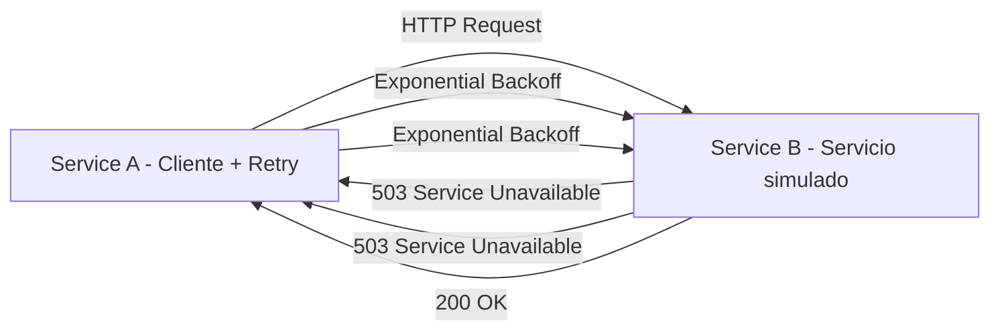

# Arquitectura - Retry Pattern

```mermaid
flowchart LR
    A[Service A - Cliente + Retry] -->|HTTP Request| B[Service B - Servicio simulado]
    B -->|503 Service Unavailable| A
    A -->|Exponential Backoff| B
    B -->|503 Service Unavailable| A
    A -->|Exponential Backoff| B
    B -->|200 OK| A
```
